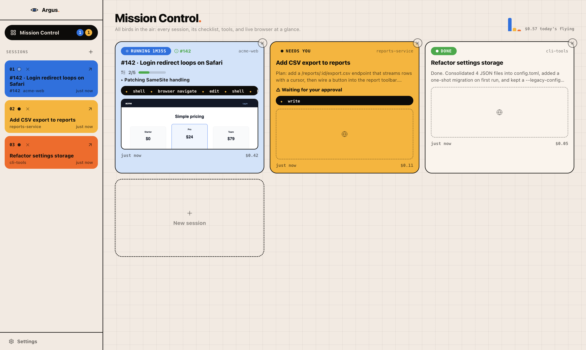
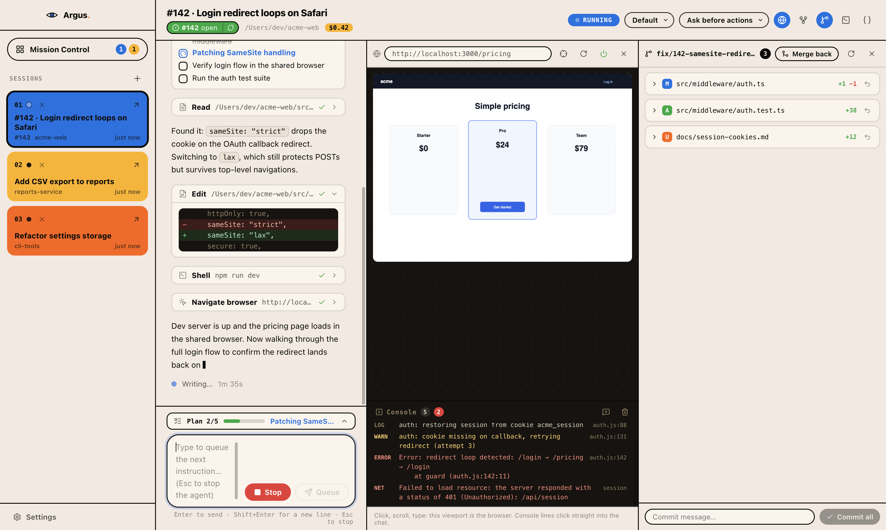
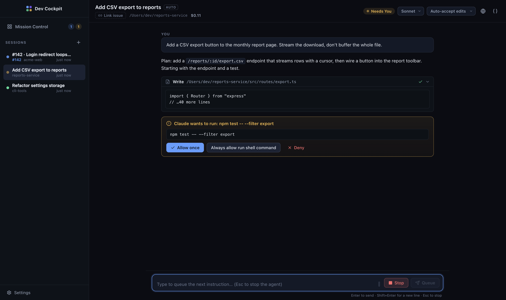

# Argus

Named for the hundred-eyed watchman of Greek myth: one place that watches many working agents.

Argus is a macOS desktop app that turns Claude Code from a terminal tool into a **mission-control cockpit**: a live board across every active agent session, an **embedded browser the agent and you fly together**, git-aware panels for diffs and dev servers, and one-click paths from evidence (console errors, server logs, broken UI elements) straight into the agent's chat.



## Install

**From a release (recommended for teammates):** download `Argus-<version>-arm64-mac.zip` from the
[latest release](https://github.com/sadeeb/dev-cockpit/releases/latest), unzip, and drag `Argus.app`
into `/Applications`. Apple Silicon only for now.

The build is unsigned (no Apple Developer ID), so macOS quarantines downloads. On first launch,
either right-click the app and choose **Open**, or clear the quarantine flag:

```bash
xattr -cr /Applications/Argus.app
```

**From source:**

```bash
npm install
npm run dev                 # development (hot reload)
npm run dist                # package dist/mac-arm64/Argus.app, copy it to /Applications
```

Requirements (the welcome screen checks these for you):

- **Node.js 18+** on your PATH. The agent engine runs on it.
- **Claude Code authentication**: either you've logged into `claude` before (subscription/OAuth), or `ANTHROPIC_API_KEY` is set.
- **GitHub CLI** (`gh`), optional: used for issue linking (falls back to the public GitHub API).
- **A Chromium-based browser**, optional: for the shared browser (Chrome/Chromium/Edge/Brave, or `npx playwright install chromium`).

Note on the cost figures in the UI: they come straight from the Claude Code engine's per-turn results, priced at API rates. On subscription (Pro/Max) auth you are not billed those dollars; read them as a usage gauge against your plan limits.

## What it does

### The core loop: evidence flows into the chat

The most annoying part of agent-driven web development is ferrying evidence between your running app and the agent. Argus attacks that end to end:

| Surface | How it reaches the agent |
|---|---|
| **Embedded co-piloted browser** | One headless Chromium per session; the Playwright MCP attaches to the same instance over CDP and the app embeds a live screencast. Click, scroll, and type in the preview; human and agent share one browser, entirely inside the app. |
| **Browser console** | A drawer under the viewport captures `console.*`, uncaught exceptions, and failed network requests. It pops open on page errors; click a line (or send the last 20) and it lands in the composer, formatted. |
| **Point-at-element** | Arm the crosshair, click anything in the preview: a readable CSS selector, the element's text, and a cropped screenshot drop into the composer. "Fix this thing" instead of describing DOM. |
| **Paste images** | Paste screenshots straight into the composer (up to 6); they ride to the agent as image blocks. |
| **Process panel** | Run your dev server *inside* the session: live ANSI-stripped tail, stop button that kills the whole process group, and any line clicks into the chat. |
| **Changes panel** | A living working-tree view: colored status chips, expandable diffs, per-file discard, and a commit box. Watch the agent's edits accumulate; commit without leaving. |

### Mission control

A board derived **purely from the agent stream**, so it can't drift out of sync. Per session: status (running / needs-you / done / error) as whole-card color fills, checklist progress with the current step, a marquee ticker of recent tools, a live browser thumbnail, cost, and elapsed time. Sessions are numbered color blocks in the sidebar; a dock badge counts sessions needing you, and native notifications fire when an unfocused session needs approval, errors, or finishes (click to jump there).



### Parallel and branching work

- **Git worktree per session** (new-session checkbox): each session gets its own `cockpit/<date>-<rand>` branch and worktree, so parallel sessions in one repo don't trample each other. A **Merge back** button in the Changes panel lands the branch in the base repo, with dirty-tree guards on both sides.
- **Fork a session** (header button or ⌘K): branch the conversation into a copy that inherits the full history, then try a different approach side by side.

### Sessions, issues, permissions

- **Auto-titled sessions**: your first prompt is handed to a fast Haiku call in parallel with the agent; the sidebar names itself moments later. Titles are click-to-edit; precedence is manual > issue > AI > default.
- **GitHub issue linking**: type `#123`, `owner/repo#123`, or paste an issue URL. Resolved via `gh` (REST fallback), shown as a state-colored badge, and the issue body + recent comments are injected so the agent starts already knowing the bug.
- **Permissions you can see**: tool prompts appear as cards with *Allow once / Always allow (session) / Always, for this repo (persists across restarts; manage rules in Settings) / Deny*, plus plan-approval cards and per-session permission modes from "ask before actions" to full-auto.
- **Models**: Default / Fable / Opus / Sonnet / Haiku, switchable mid-session.



### Fit and finish

⌘K command palette (jump to any session, toggle any panel), confetti when a plan hits 100% while you watch, a per-session cost sparkline on the board, and a design system built on cream paper, near-black ink, and flat primary color blocks (reference: units.gr). The dock icon and in-app mark are the Argus eye, and it blinks if you hover it.

## Using it

1. **⌘N**: new session. Pick the repo folder, a model, a permission mode; optionally enable the browser and a worktree.
2. Type what you want built or fixed. Mention an issue (`#123` or a URL) and it links + injects context automatically.
3. **⌘K**: palette. **⌘B**: mission control. **⌘1…9**: jump between sessions. **Esc**: stop the agent. Typing while the agent runs **queues** the next instruction.
4. Header icons per session: globe (browser panel), branch (changes panel), terminal (process panel), fork, braces (raw event drawer).
5. Sessions persist (SQLite) and **resume**: reopening a session replays its history from Claude Code's own transcript and continues the same conversation.

## The browser safety constraint

Everything the agent sees through the browser (page content, console output, form data) is sent to the model API as it works. **Use dev/test environments with test data only.** The app shows this once before enabling browser tools, and Settings can restrict the agent's reachable origins (passed to the MCP as `--allowed-origins`).

## Architecture

```
┌─ renderer (React) ──────────────────────────────────────────────┐
│ Sidebar · Conversation (structured stream) · Mission Control    │
│ Browser panel (CDP screencast + console + inspect) · Changes    │
│ Process panel · ⌘K palette · Settings                           │
└──────────────▲──────────────────────────────────────────────────┘
               │ typed IPC (CockpitEvent / CockpitApi)
┌─ main process ──────────────────────────────────────────────────┐
│ SessionManager — orchestration, status, queueing, permissions,  │
│                  forking, persisted allow-rules                 │
│ AgentSession   — Claude Agent SDK, streaming in/out, images     │
│ BrowserManager — headless Chromium, CDP screencast, console     │
│                  capture, element inspect, MCP config           │
│ ProcessManager — session-owned dev servers, group kill, tails   │
│ git.ts         — status/diff/commit/discard, worktree lifecycle │
│ Store          — SQLite (node:sqlite; JSON fallback)            │
│ TitleService   — Haiku via API key, or Agent SDK one-shot       │
│ GitHub         — gh CLI → REST fallback, context builder        │
└─────────────────────────────────────────────────────────────────┘
External: Claude Agent SDK (bundled engine) · Anthropic API ·
          GitHub · Playwright MCP (@playwright/mcp over CDP)
```

Data model (SQLite): `sessions` (id, claude_session_id, title, title_source, working_dir, status, model, permission_mode, browser_enabled, total_cost_usd, …), `github_links`, and `settings` (including persisted permission rules). Transcripts are **not** duplicated; they're replayed from Claude Code's own JSONL by `claude_session_id`. Worktree status is derived from git itself, never persisted.

The original design brief lives in [docs/SPEC.md](docs/SPEC.md).

## Scripts

| Command | What |
|---|---|
| `npm run dev` | Run with hot reload |
| `npm run dist` | Package `dist/mac-arm64/Argus.app` (electron-builder, unsigned local build) |
| `npm test` | Unit tests (issue parsing, title precedence, diffing) |
| `npm run typecheck` | Strict TypeScript over the whole app |
| `COCKPIT_SMOKE=1 npx electron .` | End-to-end: real agent turn + async title (uses your Claude auth, ~1¢) |
| `COCKPIT_BROWSER_SMOKE=1 npx electron .` | End-to-end: headless Chromium + screencast + MCP-over-CDP + console capture + element inspect |
| `COCKPIT_FORK_SMOKE=1 npx electron .` | End-to-end: fork inherits history and diverges onto its own session (~2 Haiku turns) |
| `COCKPIT_DEMO=1 npm run dev` | Seeded demo data, no tokens spent (`COCKPIT_DEMO_VIEW=board`, `session:0`, `board+palette`, `session:0+confetti`) |
| `COCKPIT_SHOT=/path.png COCKPIT_SHOT_EXIT=1 …` | Screenshot harness for any of the above |

## Implementation notes & decisions

- **The browser lives in-app**: Chromium launches with `--headless=new`; the CDP screencast panel is the only surface. No separate window competing for attention, and no way for another project's dev server to hijack the view (packaged builds carry their UI internally).
- **Per-session browsers**: each session gets its own Chromium instance + persistent profile (login state survives restarts; profiles are deleted with the session). That's how the board gets a live thumbnail per session.
- **Live reconfiguration**: model, permission mode, and browser tools all change mid-session through the SDK's control protocol; no session restarts.
- **Worktrees are derived, not stored**: a session "is a worktree session" when git says so (`--git-common-dir` probe). No schema migration, and existing sessions are unaffected.
- **asar is disabled** in packaging: the Agent SDK and `@playwright/mcp` spawn real files from `node_modules` as child processes.
- **Node 20 pins**: Electron is pinned to v38 and electron-builder to 24.x; newer majors need Node 22 (ESM-only deps). Drop both pins together when upgrading Node.
- **`AskUserQuestion` is disabled** for the agent; questions arrive as plain text in the conversation, which fits a chat UI better than the CLI's modal.
- **Renamed from Dev Cockpit** (2026-07): user-visible identity is Argus; internal identifiers (`window.cockpit`, `COCKPIT_*` env vars, IPC channel names) intentionally keep the old name to avoid a risky rename-the-world diff. First launch after the rename migrates the session store and browser profiles automatically.

## License

MIT. Free, forever. PRs welcome; merging is at the maintainer's discretion.
